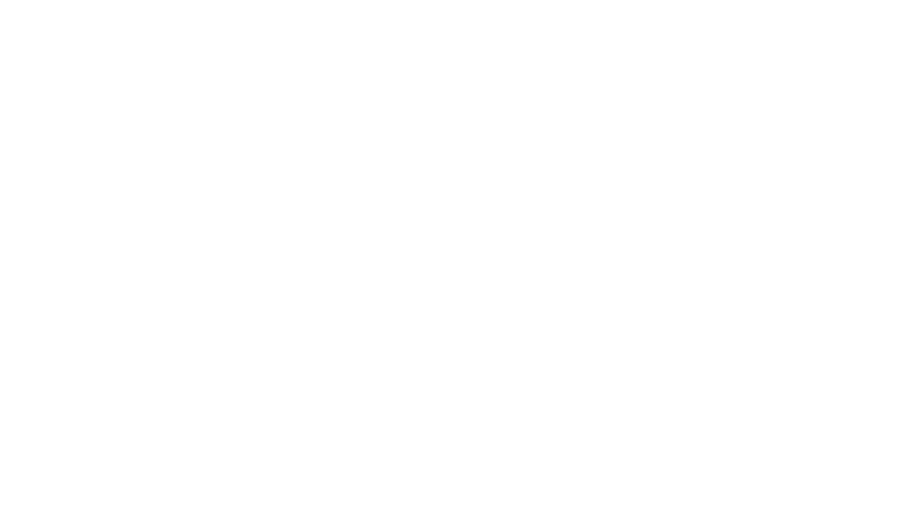
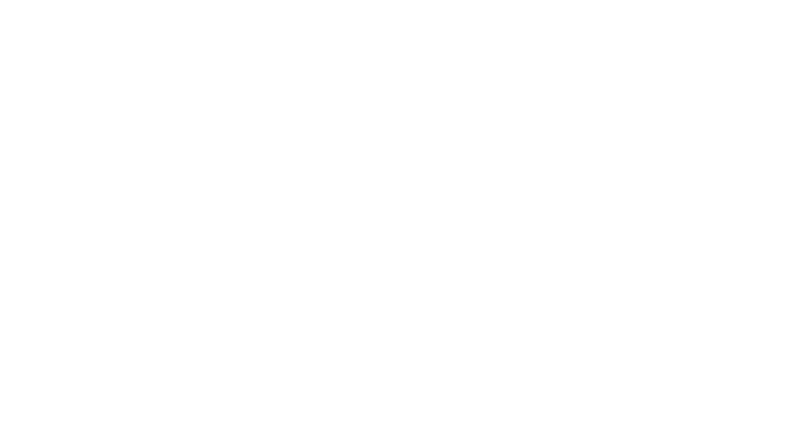

# Crab Game: Tide Survival

A top-down arcade/survival game built with React and Three.js. Control a crab on the beach — collect shells for points, then scramble to a safe rock before the tide sweeps in. Each wave gets faster and more intense. How long can you survive?

Features procedural sound effects (Web Audio API), foam particle effects on the advancing tide edge, and wave announcement banners between waves.

The title screen features an AI-controlled crab that plays the game automatically until you press SPACE.

## Screenshots

### Web App (`game`)

The animated title screen with the AI demo playing in the background. Shells, rocks, and tide are all active while the title overlay is displayed.



### Electron App (`game-electron`)

The same game running inside an Electron desktop window (1280x720).



## Video Clips

Recorded clips of the animated title screen are available in `docs/clips/` (webm format). Generate them with:

```bash
npm run clips
```

## Tech Stack

- **[React](https://react.dev/)** (v18) - UI framework
- **[react-three-fiber](https://github.com/pmndrs/react-three-fiber)** - React renderer for Three.js
- **[@react-three/drei](https://github.com/pmndrs/drei)** - Helpers and abstractions for R3F (OrthographicCamera, KeyboardControls, useTexture)
- **[Three.js](https://threejs.org/)** - 3D graphics engine
- **[Zustand](https://github.com/pmndrs/zustand)** - Game-level state management (phase, score, wave)
- **[Miniplex](https://github.com/hmans/miniplex)** - Entity Component System (ECS) for game entities (crab, shells, rocks)
- **[Nx](https://nx.dev/)** (v22) - Monorepo build system
- **[Vite](https://vite.dev/)** - Frontend bundler
- **[Electron](https://www.electronjs.org/)** - Desktop app framework
- **[TypeScript](https://www.typescriptlang.org/)** - Type safety

## Project Structure

```
apps/
  game/                   # React + R3F web game
    src/
      App.tsx             # Root: KeyboardControls, SPACE handler, auto-starts demo
      audio/
        soundManager.ts   # Procedural sound effects (Web Audio API oscillators)
      ecs/
        world.ts          # Miniplex ECS world, entity type, cached archetypes
        react.ts          # React bindings for ECS (createReactAPI)
        helpers.ts        # Entity spawning/clearing (shells, rocks, player)
      components/
        GameCanvas.tsx    # R3F Canvas, lighting, scene composition (ECS-driven)
        Camera.tsx        # Orthographic top-down camera, screen shake
        TileMap.tsx       # Sand-textured ground plane
        CrabCharacter.tsx # Crab sprite rendering + mounts controllers
        CharacterController.tsx   # Player keyboard input (WASD/arrows)
        DemoCrabController.tsx    # AI bot that plays during title screen demo
        HUD.tsx           # Title, playing, tide warning, and game over overlays
        Rock.tsx          # Safe zone boulder meshes (renders ECS entity)
        Shell.tsx         # Collectible torus meshes with bob/spin (renders ECS entity)
        Tide.tsx          # Advancing water plane + foam edge
        TideFoamParticles.tsx  # Particle foam effect on tide leading edge
        WaveManager.tsx   # Headless: drives game tick each frame
      store/
        gameStore.ts      # Zustand store: game phase, score, tide. Entity data in ECS.
    public/textures/      # Sand and crab sprite textures
  game-electron/          # Electron desktop wrapper
    src/
      main.ts             # Electron main process
      preload.ts          # Context bridge preload script
scripts/
  take-screenshots.ts     # Playwright screenshot generator
  take-clips.ts           # Playwright video clip recorder
```

### ECS Architecture

The game uses [Miniplex](https://github.com/hmans/miniplex) as an Entity Component System (ECS) to manage game entities. This separates **what exists** (ECS world) from **game rules** (Zustand store):

- **ECS World** (`ecs/world.ts`): Holds all entities (player crab, shells, rocks) as plain objects with optional component properties (`position`, `facing`, `shell`, `safeZone`, etc.)
- **Archetypes**: Cached queries like `playerEntities`, `shellEntities`, `safeZoneEntities` for efficient iteration
- **Zustand Store** (`store/gameStore.ts`): Manages game-level state (phase, wave number, score, tide progress, screen shake) and contains the `tick()` game loop that queries and mutates ECS entities
- **Entity Helpers** (`ecs/helpers.ts`): Functions to spawn/clear entities on wave transitions

This pattern keeps entity data flat and cache-friendly while letting React components subscribe to archetype changes via `useEntities()` for rendering.

## Getting Started

### Install dependencies

```bash
npm install
```

### Run the web game

```bash
npx nx serve game
```

Opens at [http://localhost:4200](http://localhost:4200). The title screen shows an AI demo — press **SPACE** to start playing.

### Run the Electron app

```bash
npx nx serve game-electron
```

Starts the Vite dev server and launches the game in an Electron window.

### Build for production

```bash
npx nx build game            # Build web app to dist/apps/game/
npx nx build game-electron   # Compile Electron app to dist/apps/game-electron/
```

### Generate screenshots

```bash
npm run screenshots
```

Uses Playwright to capture screenshots of the animated title screen in both web and Electron apps, saving them to `docs/screenshots/`.

### Record video clips

```bash
npm run clips
```

Uses Playwright to record webm video clips of the title screen demo, saving them to `docs/clips/`. Override the default 10-second duration with `CLIP_DURATION=20000 npm run clips`.

## Controls

| Key | Action |
|-----|--------|
| W / Arrow Up | Move up |
| S / Arrow Down | Move down |
| A / Arrow Left | Move left |
| D / Arrow Right | Move right |
| Space | Start game / Restart after game over |
